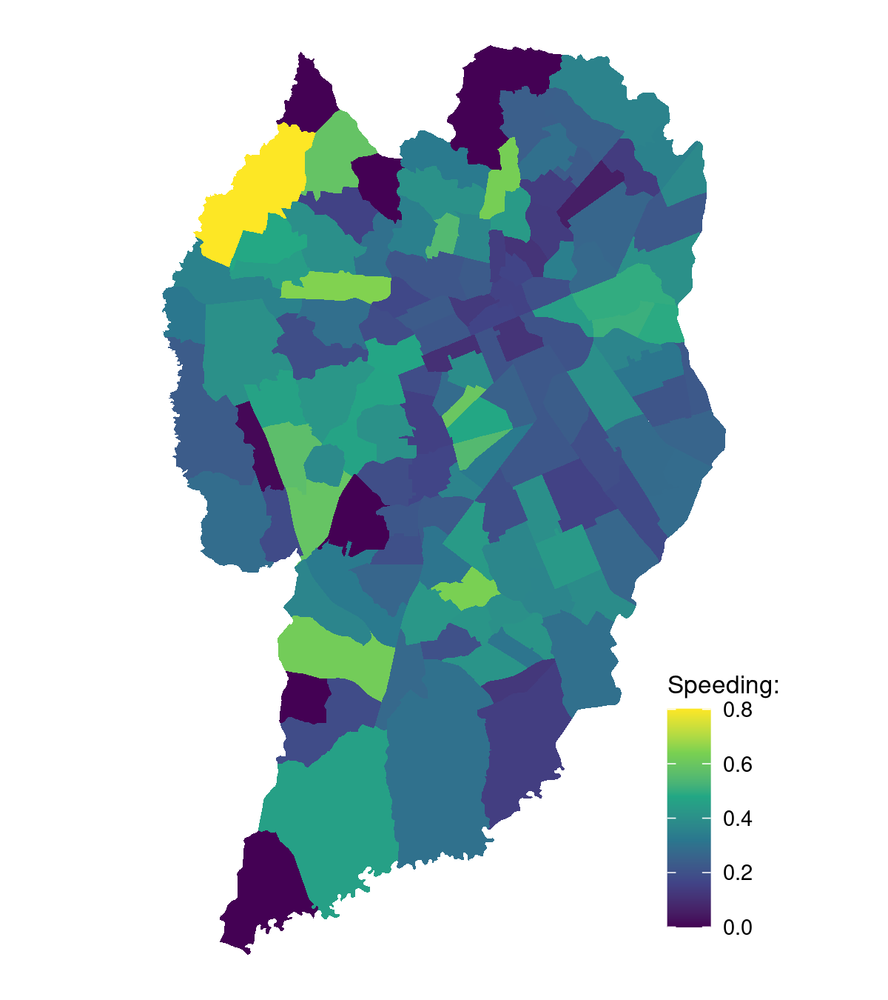
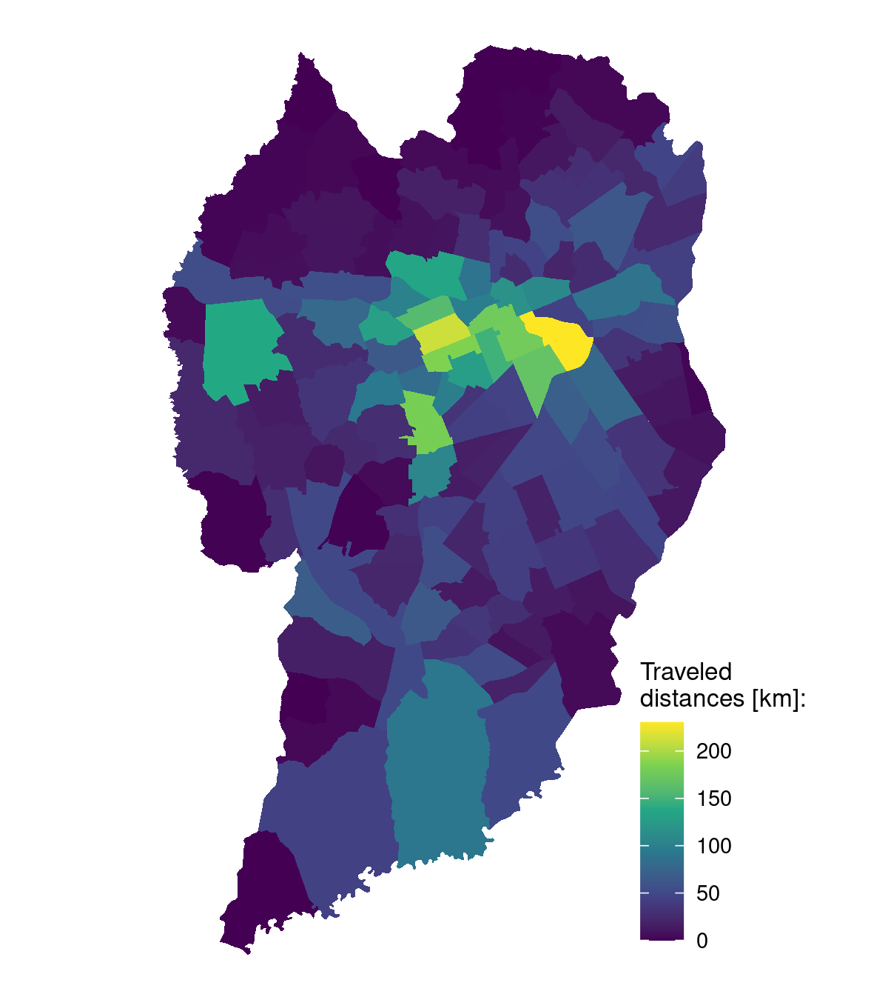
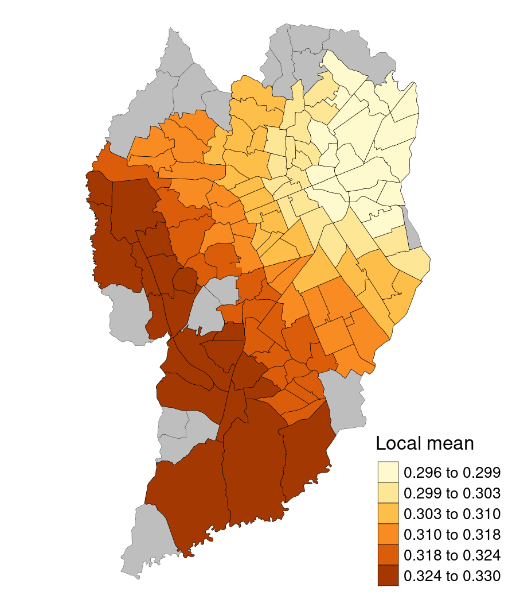
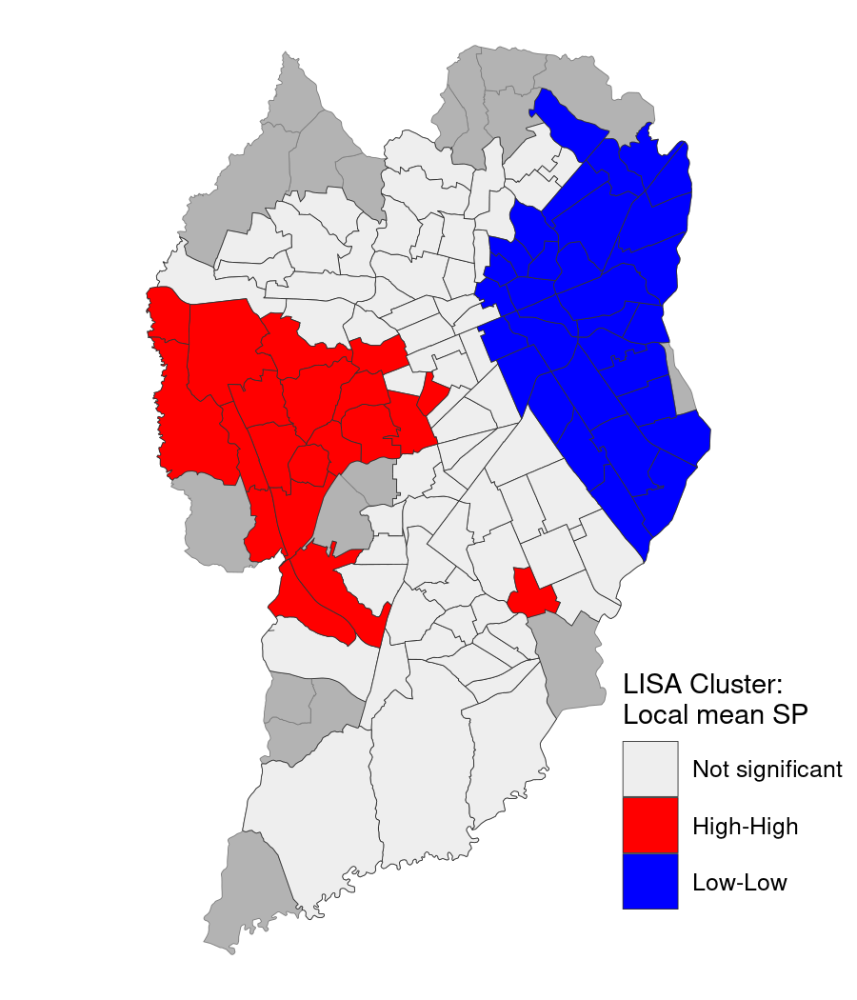
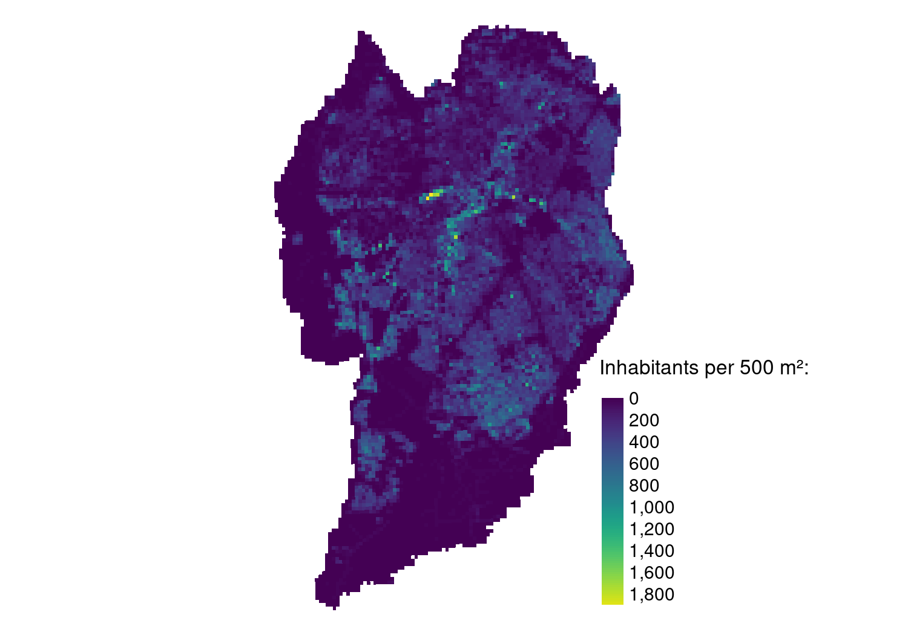

# The Impact of Built Environment on Speeding Behavior in Curitiba - Brazil

## Introduction
This repository contains the method in R programming language of the master thesis entitled "The Impact of Built Environment on Speeding Behavior in Curitiba - Brazil" from the Post-Graduate Program in Urban Planning - PPU UPPR. The main objective is to apply a geographically weighted regression (GWR) to analyze the effect of the built environment on the occurrence of speeding in Curitiba, based on its 135 traffic analysis zones (TAZ) as area unit. The speeding data was gathered in the [Brazilian Naturalistic Driving Study (NDS-BR)](http://www.tecnologia.ufpr.br/portal/ceppur/estudo-naturalistico-de-direcao-brasileiro/). 

## Structure
| File/folder       | Description                          |
| ----------------- | ------------------------------------ | 
| `R/`              | R scripts                            |
| `R/00_main.R`     | Main script                          |
| `R/01_nds.R`      | Processing of the NDS-BR data.       |
| `R/02_taz.R`      | Variable creation for each TAZ.      |
| `R/03_eda.R`      | EDA on the NDS-BR data.              |
| `R/04_gwr.R`      | GWR on the variables.                |
| `R/05_clusters.R` | Spatial cluster analysis on results. | 
| `R/06_misc.R`     | Analysis on land use and road safety |
| `data/`           | Data folder, with inputs and outputs |
| `data/output/`    | Maps, plots and text results         |
| `data/input/`     | Input data                           |
NOTE: The `input/` folder can be downloaded in the following [link](https://drive.google.com/file/d/1mSol6yksyMVdWEGysoZeLLA8qOMruwrr/view?usp=sharing) (**OUTDATED**). 

## Steps
This section contains a detailed description of each step.

### `00_main.R`
This script contains all the required packages for this project and sources all other scripts. Run this to execute all files. Before running, it is necessary to create `input/` and `output/` folders in the working directory and download the input data.

### `01_nds.R`
Imports all NDS-BR data in the `.csv` format (`drivers_pt1.csv`, etc.) and makes all the necessary corrections. It transforms the input into spatial data using the `sf` package and saves the main results from the NDS sample (travel time, travel distance, speeding, etc.)

### `02_taz.R`
Imports a spatial file with the 135 TAZ in Curitiba and calculates all the built environment (BE) variables for each zone, in addition to the speeding and traveled distance. The processing was mainly based on the `sf` package and `tidyverse` meta-package. It creates and exports maps using the `tmap` package. 

 

### `03_edands.R`
Contains an exploratory data analysis on the NDS sample. Plots information regarding travel distance and speeding, using `ggplot2` package.

### `04_gwr.R`
Applies the GWR method on the TAZ data with functions from the `GWmodel` package. Also contains the application of Moran's I method and exports the results in maps. 

Speeding: geographically weighted local mean

### `05_cluster.R`
Includes LISA clustering process, applied with functions from `rgeoda` package. Exports cluster maps of all variables. 

Speeding: LISA cluster

### `06_misc.R`
Additional maps regarding Curitiba's road hierarchy and land zoning. 

